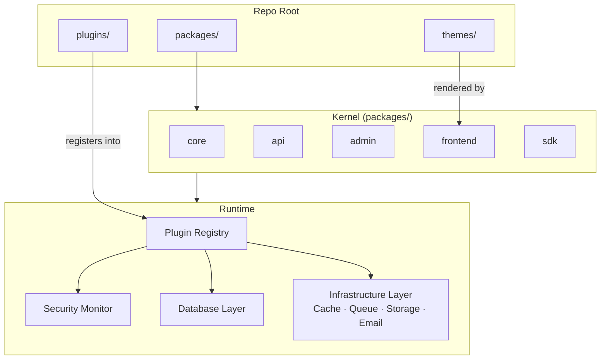

# Architecture

## Hooked Kernel Architecture

Atlantis uses a Hooked Kernel Architecture. The kernel provides base orchestration while plugins register into defined lifecycle phases: `Discovery → Boot → Route → Hook`



## Layered Request Flow

```
Browser / API Client
        │
        ▼
  Reverse Proxy (Coolify/Traefik/Nginx) — TLS only
        │
        ▼
  Platform Gateway (packages/cli — routes by HOST from the site table)
        │
   ┌────┼────────────────────┬──────────────────┐
   │    │                    │                  │
   ▼    ▼                    ▼                  ▼
API Server               Admin (Next.js)    Frontend (Next.js)
(packages/api)           (packages/admin)   (packages/frontend)
   │                         │
   └────────────┬────────────┘
                │
                ▼
         Kernel Core
    (packages/core + sdk)
                │
    ┌───────────┼───────────┐
    │           │           │
    ▼           ▼           ▼
 Plugin      Security    Database
 Registry    Monitor     Layer
    │                       │
    ▼                       ▼
Domain Plugins          Drizzle ORM
(cms, ecommerce,        (SQLite / PostgreSQL)
 finance, ...)
```

## Security & Identity

RBAC, MFA, sandboxing and audit logs are kernel features, not a plugin:

| Feature | Description |
|---------|-------------|
| **Users, Roles, Permissions** | Full RBAC system. Define granular permissions and assign them to roles, roles to users. |
| **Built-in MFA (TOTP)** | Native Time-based OTP with recovery code generation and encrypted secret storage. Works with any authenticator app. |
| **Security Monitor** | Real-time threat detection loop that monitors for anomaly spikes, brute-force attempts, and suspicious patterns. |
| **Plugin Process Isolation** | An isolated plugin is a separate OS process (own unprivileged user, heap ceiling, per-call deadline, read-only code dir) speaking a message contract; capabilities are declared in the manifest and a drift is HELD until a platform admin re-approves it. |
| **Cryptographic Signing** | Plugin signature verification on load. Unsigned or tampered plugins are rejected. |
| **TLS Certificates** | One record per host in `_system_certificates`. The chain is stored in the clear (every visitor is handed it); the private key is encrypted at rest with `SecretService` and leaves the store through exactly one method, reached only by a secret-gated internal endpoint that must never be published through the edge. Uploads are platform-admin only and validated — key/certificate pair, host coverage, expiry — before anything is written. See [Certificates and TLS](./certificates-and-tls.md). |
| **Audit Logging** | Comprehensive audit trail via `AuditManager` (`_system_audit_logs`) covering admin collection mutations, MCP tool calls, plugin database writes, capability violations, and rate-limit denials. |
| **Record Version History** | Every create/update through the admin/REST surface snapshots the record to `_system_record_versions` — for every collection of every plugin, not just CMS. Version History UI with one-click restore; also exposed over MCP (`content.versions_list` / `version_get` / `version_restore`). |
| **JWT + API Keys** | Out-of-the-box support for JWT access tokens, refresh token rotation, and long-lived API keys. |
| **SSO** | Single Sign-On provider integrations via the auth extension system. |

### Personal data erasure

Erasure is a kernel capability, not a plugin. The platform knows who holds personal data. The
framework owns the register of datasets: it holds seven itself (account, person, sessions, roles,
record versions, and the two journals) and every plugin declares its own — `ecommerce:orders`,
`finance:invoices`, `forms:submissions`, `mlm:affiliates` — through
`context.people.personalData.registerSource()`. A dataset declares which strategies it supports
(`delete`, `anonymise`, `retain`) and which is its default, and the operator picks per dataset; an
invoice stays `retain` because it is a statutory document, and the reason is stated rather than
assumed. `eraseAll()` walks the lot, so "delete my account" reaches every plugin's rows on a site
that installs no compliance product at all. The **Privacy** plugin runs the compliance *process*
over that register — DSAR intake and deadlines, identity verification, the Art. 30 record, the Art.
33 breach log, and a fulfilment report that refuses to close a request over a source that could not
be reached. Registration passes method NAMES, never callbacks, so a dataset held by an isolated
guest plugin is reached exactly like any other; and the register is narrowed to the plugins the
requesting site actually runs, so a site without MLM is never asked to account for affiliates it
does not have.

## Infrastructure & Integrations

The kernel manages all shared infrastructure so plugins share resources without collision — configure each driver once in `.env` (see [Configuration](./configuration.md)):

| Service | Providers | How It Works |
|---------|-----------|--------------|
| **Cache** | Redis, Memcached, In-Memory | Single `CacheManager` instance shared across all plugins. Configure driver once in `.env`. |
| **Queue** | BullMQ (Redis), Local polling | `QueueManager` handles background job processing. Redis for distributed, local for dev. |
| **Storage** | Local, S3, Cloudinary | `StorageManager` abstracts file I/O. Swap providers without changing plugin code. |
| **Email** | SMTP, SendGrid, Mailgun, Mock | `EmailManager` unified interface. Mock provider for local dev, real providers for production. |
| **WebSockets** | Native WS | `WebSocketManager` enables real-time events between server and themes/admin. |
| **Webhooks** | Outbound HTTP | `WebhookService` dispatches events to external systems on any kernel hook. |

## Database Layer

Not locked to any ORM or driver:

| Capability | Description |
|------------|-------------|
| **Driver Abstraction** | Database connections managed by the kernel. Plugins receive a typed `context.db` — never manage connections directly. |
| **PostgreSQL (default)** | The database for every environment, local included. Per-site isolation is a row-level-security policy the database enforces; the app connects as a plain role, never as the owner or a superuser. |
| **SQLite** | Single-site installs only (`DB_DIALECT=sqlite`): zero setup, no row-level security, so no multi-site mode. |
| **Drizzle ORM** | Default query builder. Full TypeScript inference for schema and queries. |
| **7-Phase Migrations** | Atomic migration orchestration across core and all active plugins simultaneously. Schema changes are coordinated, not scattered. |

## Multi-site Tenancy

Sites, workspaces, isolation, provisioning:

| Capability | Description |
|------------|-------------|
| **Sites** | A site is a customer: its own hosts (primary + aliases), content, people, plugin set, theme and settings on one shared platform. Resolved from the request host (storefront, api) or the signed session (admin), fail-closed: an unknown host is a 404, never a default site. |
| **Two layers of isolation** | Every tenant table carries `tenant_id`; the application injects the predicate on every query AND PostgreSQL row-level security refuses rows outside the bound site. Unique constraints are per site. |
| **Site kinds** | `site` = a storefront (theme on its domain, admins on the shared admin host). `workspace` = no storefront: the domain serves the admin, locked to a product **appearance**; the api sits on the same origin and on an `api.` alias for devices and apps. A workspace's own admins can never switch to the default console; the platform admin opens it either "as the product" or in configure mode, per session. |
| **Memberships & platform admin** | Users are members of sites with per-site roles; an admin of one site never sees another. The platform admin (`users.is_platform_admin`) runs every site from one admin with a site switcher, and is the only one who may install or platform-enable plugins, change platform keys or mint all-sites tokens. |
| **Per-site plugins, themes, settings** | Each site enables its own subset of the installed plugins (shared processes, never shared data), activates its own theme, and keeps its own plugin and system settings. New sites get their theme's initial pages seeded and their plugins' default pages materialized. |
| **Provisioning** | Sites page: create (kind, hosts, plugins, theme, or appearance + a preset the appearance declares), members, export to a portable archive, import with a preview, adopt an existing single-site deployment. A single-site install is migrated with the read-only `tenant-export` CLI. |
| **Platform gateway** | `atlantis system gateway`: routes every host from the site table, refreshed on a TTL and pushed on every change; `/healthz` reports the map age. Storefront hosts → frontend, workspace hosts → admin, `api.` aliases → api, unknown hosts → 404. Creating a site on the Sites page is live within a second — no proxy rules, no generated files. Your reverse proxy only needs to terminate TLS — or the gateway can do that too, via `GATEWAY_TLS_PORT` (see [Configuration](./configuration.md)). |

## Admin Appearances

Product consoles on the same admin:

| Capability | Description |
|------------|-------------|
| **Installed appearances** | `appearance/<slug>/appearance.json` + a runtime bundle. Built with `atlantis build appearance <slug>`, loaded at runtime, switchable per site in Settings → Appearance (or locked by a workspace's kind). |
| **Surface allowlist** | An appearance declares which plugins and admin paths its users may reach; everything else shows a containment screen — a product console, not a re-skinned admin. |
| **Workspace presets** | An appearance that is a product's console declares the plugins that product runs (`workspace` block). The "New site" form offers one preset per such appearance; the framework itself names no product. |

## Built-in i18n

Localization is a first-class feature of the kernel, not a plugin add-on. Every layer of the stack is i18n-aware.

| Capability | Description |
|------------|-------------|
| **Kernel-level Locale Engine** | The `I18nManager` handles locale resolution, fallback chains, and translation loading for the entire platform. |
| **Content Localization** | Collections and fields can be marked translatable. Plugins access translations through the kernel context. |
| **Admin UI Labels** | Admin panel field labels, navigation, and messages are fully localizable via the translation system. |
| **Plugin i18n** | Plugins register their own translation namespaces — no global conflicts. |
| **Default Locale Config** | Set `DEFAULT_LOCALE=en` in `.env`. Additional locales load from plugin/theme translation files at boot. |
| **Runtime Locale Switching** | Locale is resolved per-request via headers, query params, or user preferences — no server restart needed. |
| **Localized Fields** | Any collection field can declare `localized: true` — values are stored as per-locale maps and collapsed to the active locale on every read (REST and plugin `context.db` alike), with fallback to a locale that has content. Legacy flat strings keep working untouched. |

## Class-Based Architecture

Every piece of Atlantis follows a strict class-based pattern. There are no bare exported functions anywhere in the codebase.

| Layer | Pattern | Example |
|-------|---------|--------|
| **Routers** | Extend `BaseRouter` | `class AuthRouter extends BaseRouter` |
| **Middlewares** | Extend `BaseMiddleware` | `class AuthMiddleware extends BaseMiddleware` |
| **Controllers** | Plain classes with prototype methods | `class UserController { async getUser(...) {} }` |
| **Services** | Plain classes, pure when possible | `class OrderService { async create(...) {} }` |
| **Repositories** | Plain classes, data access only | `class OrderRepository { async findMany(...) {} }` |
| **Utilities** | Static methods on service classes | `AdminServices.getInstance().formatter.formatSize(n)` |

> **No arrow function methods.** Class methods always use prototype syntax and are bound explicitly when passed as callbacks: `router.get('/x', this.controller.handle.bind(this.controller))`.

On the UI side the same philosophy is carried by three **standalone packages** (usable in any React project, zero Atlantis dependencies):

| Package | Role |
|---------|------|
| `@fromcode119/react-class-components` | Class components without hook ceremony — `Reactor`/`PureReactor` base classes, `@prop`/`@state`/`@bound`/`@watch` decorators, method-bearing `Enum`, `Provider` contexts |
| `@fromcode119/next-build-codegen` | Build-time only — compiles separate `.view` JSX templates onto component classes and stamps `'use client'` directives; zero runtime cost |
| `@fromcode119/typescript-multiple-inheritance` | TypeScript build tool adding real OOP (multiple inheritance for data classes) and package-alias rewriting; also the framework's actual typecheck gate |

Data shapes are **classes**, not interface aliases — a `Person` or `Order` carries its own behavior and hydrates from API JSON via `static from(row)`. `interface` remains only for genuine behavioral contracts.

This means every class is independently instantiable, mockable, and replaceable — making testing and extension straightforward at every layer.

## Repository Structure

```bash
.
├── packages/
│   │  # Application kernel
│   ├── core/               # Kernel — plugin lifecycle, RBAC, security, migrations, i18n, versioning
│   ├── api/                # Express API server — REST controllers, routes, middleware, bootstrap
│   ├── admin/              # Next.js Admin panel — plugin-aware UI
│   ├── frontend/           # Next.js Frontend — theme rendering engine
│   ├── sdk/                # Public contract for plugins/themes — the ONLY import surface they may use
│   │  # Infrastructure providers (kernel-managed, swappable)
│   ├── auth/               # JWT sessions, refresh rotation, MFA/TOTP, API keys, SSO extensions
│   ├── database/           # Driver abstraction (SQLite/PostgreSQL), Drizzle integration, proxies
│   ├── cache/               # CacheManager — Redis / Memcached / in-memory
│   ├── email/               # EmailManager — SMTP / SendGrid / Mailgun / mock
│   ├── media/               # StorageManager + media pipeline — local / S3 / Cloudinary
│   ├── scheduler/           # Scheduled/background job execution
│   │  # AI & MCP
│   ├── ai/                 # Admin Assistant runtime — LLM clients, classifier, MCP tool packs
│   ├── mcp/                # MCP schema/registry/bridge primitives (shared by server + clients)
│   ├── mcp-server/         # Standalone MCP server binary (stdio + Streamable HTTP client)
│   │  # Standalone OOP stack (reusable outside Atlantis)
│   ├── react-class-components/  # Class-based React primitives — Reactor/PureReactor, @prop/@state/@bound/@watch, Enum
│   ├── next-build-codegen/             # Build-time companion — .view template compiler, 'use client' injection
│   ├── typescript-multiple-inheritance/              # TypeScript build tool — multiple inheritance, package aliases, real typecheck
│   ├── arch-guard/             # Architecture boundary enforcement — who may import what
│   │  # Distribution & tooling
│   ├── marketplace-client/ # Client for plugin/theme marketplace installs and updates
│   ├── plugins/            # Plugin loading/packaging support
│   ├── react/              # Legacy React bridge (being absorbed by react-class-components)
│   ├── extension-builder/  # Packs plugins and themes — build pipeline, SSR dep closure, integrity stamping
│   ├── queue/              # Background job queue — BullMQ or in-process, one API for both
│   ├── next/               # Shared Next.js glue
│   ├── create/             # `npm create` scaffolder for new Atlantis apps
│   └── cli/                # Atlantis CLI tool
├── plugins/           # 🔌 Domain plugins (cms, ecommerce, finance, logistics, ...)
├── themes/            # 🎨 UI themes and layout bundles
├── appearance/        # 🎛️ Admin appearances — product consoles (nexora, tagiqx, ...)
├── deploy/            # Production compose files and the container entrypoint
├── starters/          # Local dev proxy and startup scripts
├── docker-compose.yml
├── Dockerfile
├── .env.example
└── package.json
```

See the [module documentation index](./modules/README.md) for per-package docs, and the
[SDK contract](../packages/sdk/) for the public plugin/theme API surface.
